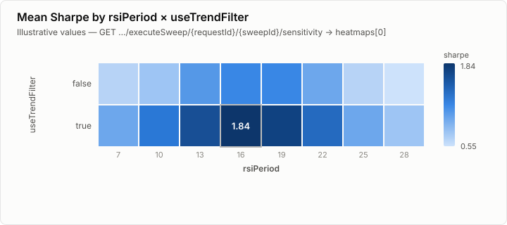
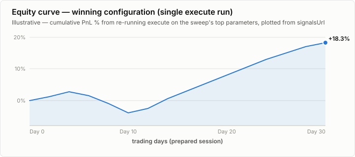

# Parameter Sweeps

Run a strategy across a parameter grid instead of one fixed set of values, poll a ranked
leaderboard, optionally validate the winner out of sample with walk-forward folds, and inspect
which parameters actually moved the objective.

All four endpoints share `{exchangeId}/{type}/executeSweep/{requestId}` (`requestId` is the
`jobId` from `POST /backtest/{exchangeId}/{type}/prepare` — a sweep reuses the same prepared
dataset, never a fresh one):

| Method | Path | Purpose |
|---|---|---|
| `POST` | `.../executeSweep/{requestId}` | Submit a sweep |
| `GET` | `.../executeSweep/{requestId}/{sweepId}` | Poll progress and the leaderboard |
| `DELETE` | `.../executeSweep/{requestId}/{sweepId}` | Cancel a running sweep |
| `GET` | `.../executeSweep/{requestId}/{sweepId}/sensitivity` | Marginals and heatmaps |

## Submitting a sweep

`POST .../executeSweep/{requestId}`

### Request body — `ExecuteSweepRequest`

| Field | Type | Default | Notes |
|---|---|---|---|
| `strategyId` | string | — | required |
| `sweep` | [`SweepSpecRequest`](#sweep--sweepspecrequest) | — | required — the grid itself |
| `baseConfig` | [`SweepBaseConfig`](#baseconfig--sweepbaseconfig) | — | backtest config shared by every trial |
| `walkForward` | [`WalkForwardRequest`](#walk-forward-validation) | — | opt in to out-of-sample validation instead of a flat sweep |
| `storeSignals` | boolean | `false` | store signals for every trial; keep `false` for normal sweeps |
| `shards` | integer ≥ 0 | `0` | requested horizontal shard count; `0` selects automatically |
| `minTradeFloor` | integer ≥ 0 | `30` | trials below this trade count are flagged (`belowTradeFloor`) but stay in the results |

#### `sweep` — `SweepSpecRequest`

| Field | Type | Default | Notes |
|---|---|---|---|
| `params` | map of string → [`SweepAxis`](#params--map-of-sweepaxis) | — | required, ≥ 1 entry — one axis per swept parameter |
| `sampler` | `grid` \| `random` \| `lhs` | `grid` | |
| `objective` | `sharpe` \| `sortino` \| `pnl` \| `maxdd` | `sharpe` | |
| `samples` | integer ≥ 1 | — | sample count for `random`/`lhs`; ignored by `grid` |
| `seed` | int64 | — | reproducibility seed. Omitted → the server generates one (Java's `L64X128MixRandom`) and returns the effective value in `ExecuteSweepAccepted.seed` |

##### `params` — map of `SweepAxis`

Each strategy property being swept gets one axis, expressed as either a numeric range or an
explicit list:

```json
"rsiPeriod":       {"from": 7, "to": 28, "step": 1},
"useTrendFilter":  {"values": [true, false]}
```

- **range** — `from`, `to`, `step` (all required, `step` > 0)
- **enumerated** — `values` (≥ 1 item, each `number` or `boolean`)

#### `baseConfig` — `SweepBaseConfig`

Applied identically to every trial in the sweep.

| Field | Type | Default | Notes |
|---|---|---|---|
| `initialFunding` | number > 0 | `10000` | |
| `feeRate` | number ≥ 0 | `0.001` | |
| `buyFeeRate` / `sellFeeRate` | number ≥ 0 | — | override `feeRate` per side |
| `feeLeg` | `RECEIVED` \| `QUOTE` \| `BASE` | `RECEIVED` | |
| `percentAmountToLock` | number, 0 < n ≤ 100 | — | |

### Example

```bash
curl -X POST "https://api.qtsurfer.net/v1/backtest/binance/ticker/executeSweep/$PREPARE_JOB_ID" \
  -H "Authorization: Bearer $TOKEN" \
  -H "Content-Type: application/json" \
  -d '{
    "strategyId": "2ul144qe9tlwzu5anhwvc6",
    "sweep": {
      "sampler": "grid",
      "objective": "sharpe",
      "params": {
        "rsiPeriod": {"from": 7, "to": 28, "step": 1},
        "useTrendFilter": {"values": [true, false]}
      }
    }
  }'
```

`ExecuteSweepAccepted` (`202`):

```json
{
  "sweepId": "swp_95e47a7f0966ce11",
  "requestId": "5ikYAMIO...",
  "totalRuns": 44,
  "shards": 1,
  "seed": 487221,
  "queued": true
}
```

`queued: false` means an identical sweep already existed and this call did not enqueue a
duplicate — prepare and execute requests are idempotent, keyed on their body.

Errors: `400` invalid spec or the expanded grid exceeds the server limit · `404` `requestId`
not found or expired · `429` sweep queue or per-user concurrency limit reached.

## Polling progress and the leaderboard

`GET .../executeSweep/{requestId}/{sweepId}`

| Query param | Type | Default | Notes |
|---|---|---|---|
| `objective` | `sharpe` \| `sortino` \| `pnl` \| `maxdd` | sweep's own objective | re-score the leaderboard by a different objective than the one it was submitted with |
| `order` | `ranked` \| `natural` | `ranked` | `natural` returns every row, untruncated, in stable `runIx` order — use it to materialise durable trial rows |
| `ranking` | `plateau` \| `raw` | `plateau` | how the `ranked` view is ordered; ignored when `order=natural` |

`ranking=plateau` sorts by **plateau score** — the objective of the *worst* run in a parameter
point's immediate neighbourhood — rather than the raw objective, so a spike that doesn't survive
the parameters moving slightly no longer wins by default. Pass `ranking=raw` for the old,
unadjusted ordering.

### Response — `ExecuteSweepResult`

| Field | Notes |
|---|---|
| `status` | `RUNNING` \| `COMPLETED` \| `PARTIAL` \| `CANCELLED` |
| `ranking` | which ordering was **actually** applied — not always the one requested (a sweep with no stored grid can't be plateau-ranked and falls back to `raw`) |
| `pbo`, `pboSplits` | probability of backtest overfitting, combinatorially symmetric cross-validation over the whole sweep. `> ~0.5` → the sweep is selecting noise. Present only once the last shard finishes, and only for a non-walk-forward sweep |
| `failReason` | why the sweep produced less than it should — the cause reported by the *first* shard to fail, not an exhaustive list. Turns an empty leaderboard with `done: 0` into an answer (e.g. `"Failed to load/configure strategy"`) instead of a mystery |
| `progress` | [`SweepProgress`](#progress--sweepprogress) |
| `leaderboardSize` | total rows currently available |
| `truncated` | `true` only when the `ranked` view exceeds its display limit |
| `leaderboard` | array of [`SweepRunRow`](#leaderboard-rows--sweeprunrow) |
| `walkForward` | present only for a walk-forward sweep — see [below](#walk-forward-validation) |

#### `progress` — `SweepProgress`

Partitions the shards (or, for a walk-forward sweep, the folds): every unit is finished, failed,
retrying, or not yet started.

| Field | Notes |
|---|---|
| `done`, `total` | rows/units completed vs. total |
| `aborted` | individual **runs** that executed and aborted (row-level) |
| `shardCount`, `pendingShards` | total and still-pending shards |
| `failedShards` | whole shards/folds that failed and will **not** be retried — distinct from `aborted`, which counts bad runs, not missing units |
| `retrying` | units whose last attempt hit a transient error and are queued to retry — not a failure yet |
| `notStarted` | units that haven't reported anything; persistent alongside a rising `stalledSeconds` is worth investigating |
| `stalledSeconds` | seconds since anything last advanced; omitted on a finished sweep |
| `etaSeconds` | rough seconds remaining; runs conservative (2–5× long) when part of the sweep spent time waiting to retry. Omitted, never `0`, when it can't be computed |

#### Leaderboard rows — `SweepRunRow`

| Field | Notes |
|---|---|
| `runIx` | deterministic zero-based expansion index, stable across shards and ranking |
| `rank` | present only in the `ranked` view |
| `plateauScore`, `neighbourCount` | plateau score is the objective of the worst neighbour; `neighbourCount: 0` means the point had no neighbours to compare against — the score is unevidenced, not confirmed. Always read together |
| `deflatedSharpe` | probability this run's Sharpe reflects real edge rather than the best draw among however many vectors were tried. `> ~0.95` survives the multiple-testing correction; `≤ 0.5` is indistinguishable from the best of a pile of coin flips |
| `params`, `sharpe`, `sortino`, `pnl`, `pnlPct`, `cagr`, `maxDdPct`, `trades`, `winRate` | the trial's own results |
| `belowTradeFloor`, `aborted`, `runtimeMs` | |

### Example

```bash
curl "https://api.qtsurfer.net/v1/backtest/binance/ticker/executeSweep/$PREPARE_JOB_ID/$SWEEP_ID" \
  -H "Authorization: Bearer $TOKEN"
```

```json
{
  "status": "RUNNING",
  "ranking": "plateau",
  "progress": {
    "done": 31, "total": 44, "aborted": 0,
    "shardCount": 1, "pendingShards": 0,
    "failedShards": 0, "retrying": 0, "notStarted": 1,
    "etaSeconds": 12
  },
  "leaderboardSize": 31,
  "truncated": false,
  "leaderboard": [
    {
      "runIx": 12, "rank": 1,
      "params": {"rsiPeriod": 16, "useTrendFilter": true},
      "sharpe": 1.84, "plateauScore": 1.61, "neighbourCount": 6,
      "sortino": 2.10, "pnl": 812.40, "pnlPct": 8.12, "cagr": 0.31,
      "maxDdPct": 6.4, "trades": 118, "winRate": 57.6,
      "belowTradeFloor": false, "aborted": false, "runtimeMs": 842
    }
  ]
}
```

Errors: `404` sweep not found or expired.

## Walk-forward validation

Add `walkForward` to `executeSweep`'s body to test whether the winning parameters keep working,
not just which ones won. The data splits into sequential folds; each optimizes the full grid on
its own window and is scored **only** on the window immediately after — data its winner was not
chosen on. Omit the block and nothing about the sweep changes, including the response shape.

The cost is why it's opt-in: `folds × totalRuns` backtests, so 4 folds over a 500-point grid is
2004 runs where the plain sweep is 500. A request exceeding the server's sweep budget is a `400`.

### `WalkForwardRequest`

| Field | Type | Default | Notes |
|---|---|---|---|
| `folds` | integer ≥ 2 | — | required. 2 is a structural minimum, not a tuning choice: `paramDrift` compares consecutive fold winners, and a single fold has no pair to compare |
| `inSamplePct` | integer, 10–90 | `66` | share of the session each fold optimizes on; the remainder is where its winner is scored |

### Example

```bash
curl -X POST "https://api.qtsurfer.net/v1/backtest/binance/ticker/executeSweep/$PREPARE_JOB_ID" \
  -H "Authorization: Bearer $TOKEN" \
  -H "Content-Type: application/json" \
  -d '{
    "strategyId": "2ul144qe9tlwzu5anhwvc6",
    "sweep": {"sampler":"grid","objective":"sharpe",
              "params":{"rsiPeriod":{"from":7,"to":28,"step":1}}},
    "walkForward": {"folds": 4}
  }'
# → 202 {"sweepId":"swp_...","walkForward":{"folds":4,"inSamplePct":66,"totalRuns":92}}
```

`ExecuteSweepAccepted.walkForward` (`WalkForwardAccepted`: `folds`, `inSamplePct`, `totalRuns`)
confirms the fold plan the moment the sweep is accepted — before any fold has finished — so it's
safe to branch on while polling whether a sweep is walk-forward or a flat grid.

### Result shape — `WalkForwardResult`

On `getSweepResult`, `ExecuteSweepResult.walkForward` is present only for a walk-forward sweep,
and its **presence**, not its contents, is what identifies one:

| Field | Notes |
|---|---|
| `folds`, `inSamplePct` | requested folds and resolved in-sample share |
| `completedFolds` | folds finished so far; `0` while the first is still running |
| `paramDrift` | mean normalized lattice distance between consecutive fold winners. Low = the parameter means something; winners jumping across the grid every fold = the sweep is fitting noise. **Absent is not zero** — omitted when it can't be computed (fewer than two folds finished), because `0` is itself a meaningful reading here |
| `results` | one [`WalkForwardFold`](#walkforwardfold) per completed fold, oldest first |

#### `WalkForwardFold`

| Field | Notes |
|---|---|
| `foldIx` | position in the sequence, oldest first |
| `inSampleFrom`, `inSampleTo`, `outOfSampleTo` | window indices into the prepared session |
| `params` | the vector that won this fold's optimization window |
| `inSampleSharpe` | how that winner scored on the window it was chosen on — only there to compare against `outOfSample`, since any grid produces a flattering in-sample winner |
| `outOfSample` | a full [`SweepRunRow`](#leaderboard-rows--sweeprunrow) — the honest number |
| `vectorsRun` | vectors evaluated in-sample before picking the winner |

When `walkForward` is present, the top-level `leaderboard` becomes one row per completed fold —
that fold's out-of-sample winner, `runIx` carrying the fold index rather than a grid position —
instead of one row per parameter point. `ranking` is always `raw`, and no plateau score, DSR, or
`pbo` is reported: the out-of-sample scores are already the honest number.

## Parameter sensitivity

`GET .../executeSweep/{requestId}/{sweepId}/sensitivity`

| Query param | Type | Notes |
|---|---|---|
| `objective` | `sharpe` \| `sortino` \| `pnl` \| `maxdd` | defaults to the sweep's own objective |

Aggregated directly from the sweep's stored rows — no re-run, no engine call — so it works on a
sweep still in flight (the aggregates then describe whatever finished so far). Aborted runs are
excluded throughout: a run that threw measured nothing, and counting it as a bad outcome would
invent evidence against a value that was never really tested. `404` if the sweep is unknown or
expired.

A leaderboard says which point won; it can't say whether an axis mattered at all. Sensitivity
answers that with two views:

- **Marginal** — one axis, every other axis collapsed away: for each value, aggregate every run
  that used it, whatever the rest of the parameters were. A flat marginal means the axis was
  irrelevant over the range swept. `best`, `mean`, and `worst` disagreeing is itself a signal — a
  high `best` with a poor `mean` only works in specific company, an interaction invisible behind
  a single number.
- **Heatmap** — the same, over a *pair* of axes, so that interaction becomes visible directly.
  Quadratic in the axis count (`N` axes → `N(N-1)/2` surfaces), which is why this is a separate
  endpoint rather than fields on the poll response — `heatmapsTruncated: true` means at least one
  surface was left out to stay inside the response budget.

### `SweepSensitivity`

| Field | Notes |
|---|---|
| `rowsAnalysed` | rows available when computed; grows while the sweep is still running |
| `marginals` | array of `{param, points: [{value, count, best, mean, worst}]}` |
| `heatmaps` | array of `{paramA, paramB, cells: [{valueA, valueB, count, best, mean}]}` |
| `heatmapsTruncated` | `true` when a two-parameter surface was dropped to stay inside the budget |

### Example

```bash
curl "https://api.qtsurfer.net/v1/backtest/binance/ticker/executeSweep/$PREPARE_JOB_ID/$SWEEP_ID/sensitivity" \
  -H "Authorization: Bearer $TOKEN"
```

```json
{
  "sweepId": "swp_95e47a7f0966ce11",
  "status": "COMPLETED",
  "objective": "sharpe",
  "rowsAnalysed": 44,
  "marginals": [
    {
      "param": "rsiPeriod",
      "points": [
        {"value": 7,  "count": 4, "best": 0.94, "mean": 0.62, "worst": 0.31},
        {"value": 16, "count": 4, "best": 1.84, "mean": 1.53, "worst": 1.22},
        {"value": 28, "count": 4, "best": 0.77, "mean": 0.55, "worst": 0.28}
      ]
    }
  ],
  "heatmaps": [
    {
      "paramA": "rsiPeriod",
      "paramB": "useTrendFilter",
      "cells": [
        {"valueA": 16, "valueB": true, "count": 1, "best": 1.84, "mean": 1.84}
      ]
    }
  ],
  "heatmapsTruncated": false
}
```

Rendered, `heatmaps[0]` above looks like this (illustrative — the response only carries the
numbers; plotting them is a client concern):



## Cancelling a sweep

`DELETE .../executeSweep/{requestId}/{sweepId}`

Requests cancellation between parameter vectors — already-completed rows remain readable.

```json
{"status": "cancelling", "sweepId": "swp_95e47a7f0966ce11"}
```

Errors: `404` sweep not found.

## Visualizing the winner: equity curve

The sweep endpoints never return a time series — a `SweepRunRow` is one aggregate outcome per
trial, not its trade-by-trade history. To see *how* the winning configuration got there, take
its `params` from the leaderboard and run one normal `POST /backtest/{exchangeId}/{type}/execute`
against the same `prepareJobId`; that response's `signalsUrl` points at a Parquet file with every
emitted signal, which is what a client loads to plot cumulative PnL over time:



See [`POST .../execute` in the main README](../README.md#execute-backtest) for the request/response shape.
