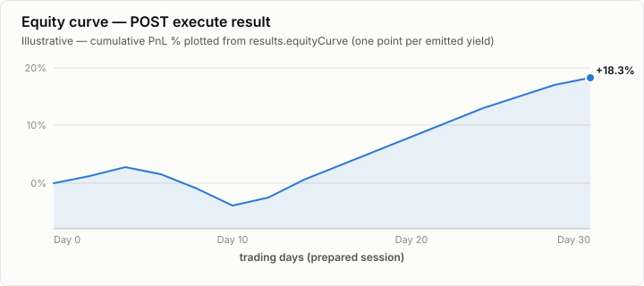

# Equity curves

An equity curve describes the account value through a backtest. QTSurfer returns the same
`EquityCurveResult` contract for a plain backtest and for a retained sweep trial, with different
delivery rules:

- A plain backtest returns the curve inline in `results.equityCurve` and fixes its transform when
  the execution is submitted.
- A sweep leaderboard row may carry a pointer in `equityCurve.url`; fetch it separately and choose
  the transform at read time.

The first point is an anchor at the backtest `from` timestamp with the initial capital. Every later
point is one sample per emitted yield. `equity` is account value (`initialCapital + cumulativePnl`),
not a percentage. To chart percentage return, normalize each value as
`(equity / initialEquity - 1) * 100`.



## Response shapes

`meta.outMode` determines which point representation is present.

### `ARRAY`

```json
{
  "points": [
    {"timestamp": 1700000000000, "equity": 100.0},
    {"timestamp": 1700000060000, "equity": 110.5},
    {"timestamp": 1700000120000, "equity": 90.25}
  ],
  "meta": {
    "inputPointCount": 3,
    "outputPointCount": 3,
    "resampled": false,
    "differential": false,
    "outMode": "ARRAY"
  }
}
```

### `SHORT`

`SHORT` removes repeated JSON property names by returning parallel arrays. Values at the same index
form one point.

```json
{
  "timestamps": [1700000000000, 1700000060000, 1700000120000],
  "equities": [100.0, 110.5, 90.25],
  "meta": {
    "inputPointCount": 3,
    "outputPointCount": 3,
    "resampled": false,
    "differential": false,
    "outMode": "SHORT"
  }
}
```

Do not infer the shape from the request. A server size guard may force a compact representation;
`meta.outMode` is the source of truth.

## Transform pipeline

Transforms run in a fixed order: `resample` → `differential` → `outMode`.

| Option | Type and default | Effect |
|---|---|---|
| `resample` | integer ≥ 2; omitted | Limits the result to at most this many points. Downsampling preserves the exact first and last points and global extrema. A ceiling above the input size is a valid no-op. |
| `differential` | boolean; `false` | Keeps the first post-resample point absolute and delta-encodes timestamp and equity from the second point onward. |
| `outMode` | `ARRAY` \| `SHORT`; `ARRAY` | Chooses objects or parallel arrays after the preceding stages. |

The response metadata reports what actually happened:

| Metadata | Meaning |
|---|---|
| `inputPointCount` | Number of points received by the transform pipeline. |
| `outputPointCount` | Number of points after the complete pipeline. |
| `resampled` | `true` only when resampling changed the point count. |
| `differential` | `true` only when delta encoding ran; a zero- or one-point curve has nothing to encode. |
| `outMode` | Actual JSON representation served. |

### Decoding differential data

The first point remains absolute. Reconstruct each following point by adding its delta to the
previous reconstructed value:

```json
{
  "timestamps": [1700000000000, 60000, 60000],
  "equities": [100.0, 10.5, -20.25],
  "meta": {
    "inputPointCount": 3,
    "outputPointCount": 3,
    "resampled": false,
    "differential": true,
    "outMode": "SHORT"
  }
}
```

This reconstructs timestamps `1700000000000`, `1700000060000`, `1700000120000` and equities
`100.0`, `110.5`, `90.25`. The same rule applies to `points` in `ARRAY` mode.

## Plain backtests: choose the transform on submit

A plain execution has no later curve endpoint, so its transform is baked into the stored result.
Set `equityCurve` on `POST .../execute`:

```bash
curl -X POST https://api.qtsurfer.net/v1/backtest/binance/ticker/execute \
  -H "Authorization: Bearer $TOKEN" \
  -H "Content-Type: application/json" \
  -d '{
    "prepareJobId": "5ikYAMIO...",
    "strategyId": "2ul144qe9tlwzu5anhwvc6",
    "equityCurve": {"resample": 500, "differential": true, "outMode": "SHORT"}
  }'
```

Omitting `equityCurve` means `ARRAY`, no requested resampling, and no differential encoding. The
transform participates in execution idempotency:
`(prepareJobId, strategyId, storeSignals, equityCurve) → jobId`. Changing only the transform creates
a different execution rather than reshaping an existing result.

The curve is present with yield metrics after the strategy emits at least one trade. For indicator
values and buy/sell markers behind the aggregate curve, request stored signals and read the Parquet
file at `signalsUrl`.

## Sweeps: select, retain, and fetch curves

Sweep rows are aggregate outcomes and do not carry time series by default. `EquityCurveRequest`
adds retention controls to the shared transform options:

| Field | Type and default | Effect |
|---|---|---|
| `mode` | `auto` \| `topN` \| `topPct` \| `none`; `auto` | Chooses which completed trials retain curves. `auto` delegates retention to server size limits; use `topN` or `topPct` when deterministic retention is required. |
| `n` | integer ≥ 1 | Number of ranked trials retained by `topN`. |
| `maxPct` | number > 0 and ≤ 100 | Percentage of ranked trials retained by `topPct`, rounded up with a minimum of one. |
| `resample`, `differential`, `outMode` | shared options | Defaults used when a later curve `GET` omits its corresponding query parameter. They do not affect retention. |

```json
{
  "strategyId": "2ul144qe9tlwzu5anhwvc6",
  "sweep": {
    "sampler": "grid",
    "objective": "sharpe",
    "params": {"rsiPeriod": {"from": 7, "to": 28, "step": 1}}
  },
  "equityCurve": {
    "mode": "topN",
    "n": 5,
    "resample": 500,
    "outMode": "SHORT"
  }
}
```

Retention (`mode`, `n`, `maxPct`) contributes to sweep identity. Transform defaults do not: two
otherwise identical submissions that differ only in `resample`, `differential`, or `outMode`
deduplicate to the same `sweepId`.

Selected leaderboard rows contain a pointer, not inline points:

```json
{
  "runIx": 12,
  "equityCurve": {
    "meta": {
      "inputPointCount": 118,
      "outputPointCount": 118,
      "resampled": false,
      "differential": false,
      "outMode": "ARRAY"
    },
    "url": "/v1/backtest/binance/ticker/executeSweep/5ikYAMIO.../swp_95e47a7f0966ce11/runs/12/equityCurve"
  }
}
```

`equityCurve` is absent, not `null`, on unselected rows. The row's metadata is a preview captured
when selection occurred; fetch `url` for the actual, possibly size-guarded curve and authoritative
metadata.

## Sweep curve query parameters

`GET .../runs/{runIx}/equityCurve` accepts `outMode`, `resample`, and `differential`. A parameter
omitted from the query inherits the sweep submission's transform default. An explicitly supplied
value overrides that default for this read:

```bash
curl "https://api.qtsurfer.net$EQUITY_CURVE_URL?outMode=SHORT&resample=500&differential=true" \
  -H "Authorization: Bearer $TOKEN"
```

The server may still force a smaller representation above its size thresholds. Parse the response
according to `meta`, not according to the submitted defaults or query string.

The endpoint returns `404` when the sweep or `runIx` is unknown, or when that trial's curve was not
retained. Those cases are intentionally indistinguishable to the caller.

Without a retained sweep curve, reproduce the chosen trial by compiling its winning parameter values
as strategy defaults and running a plain execution against the same prepared window.
